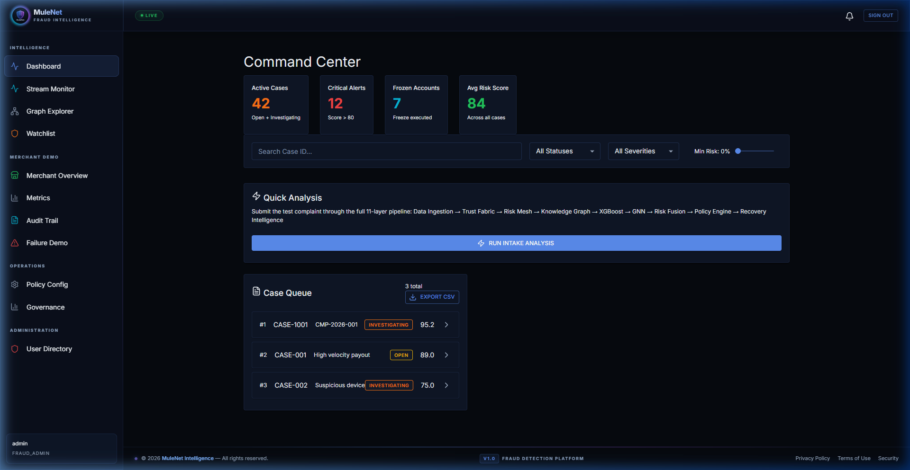
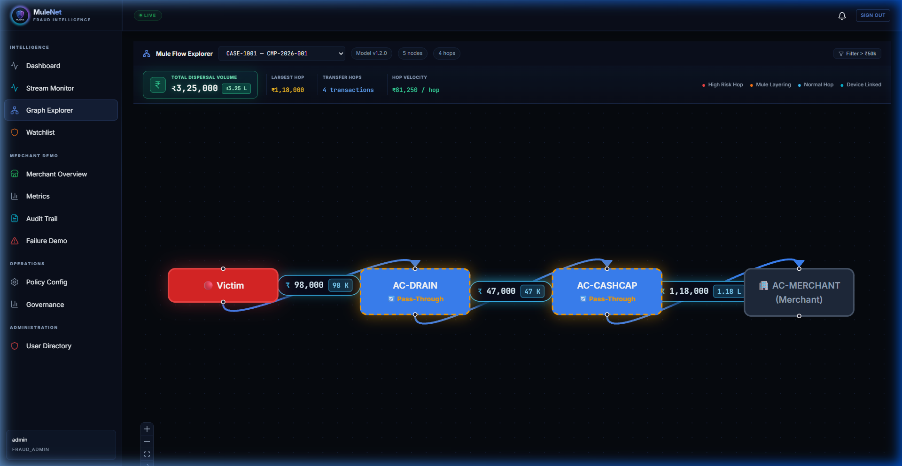
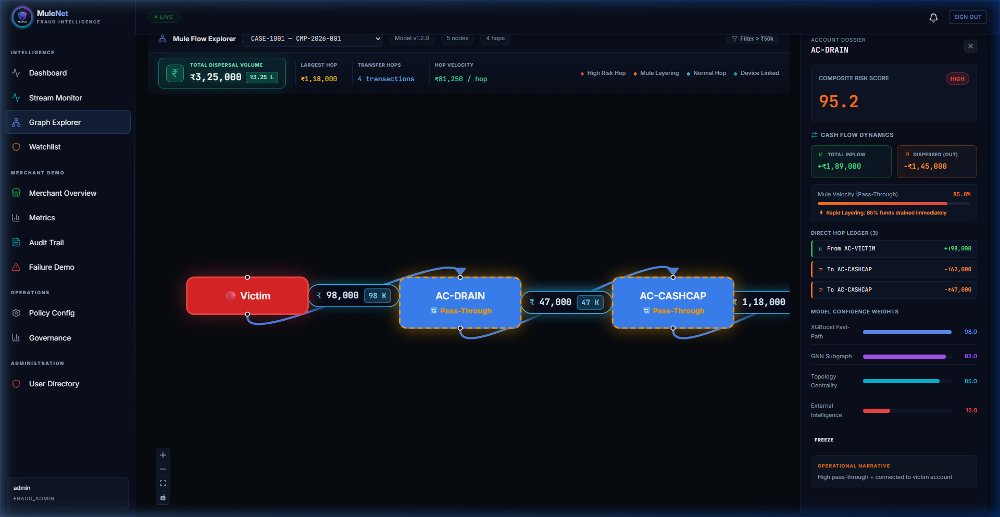
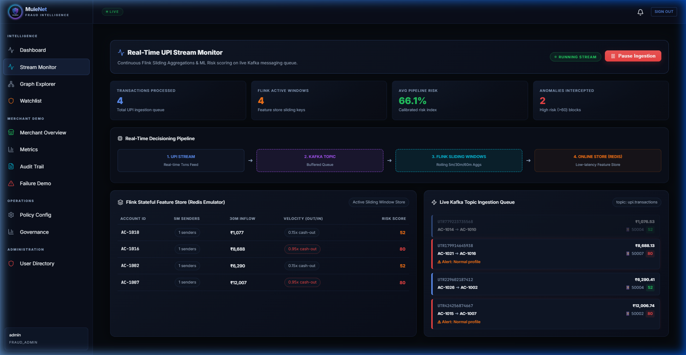
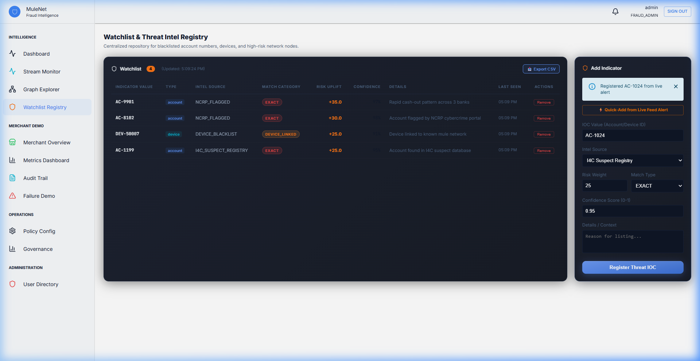
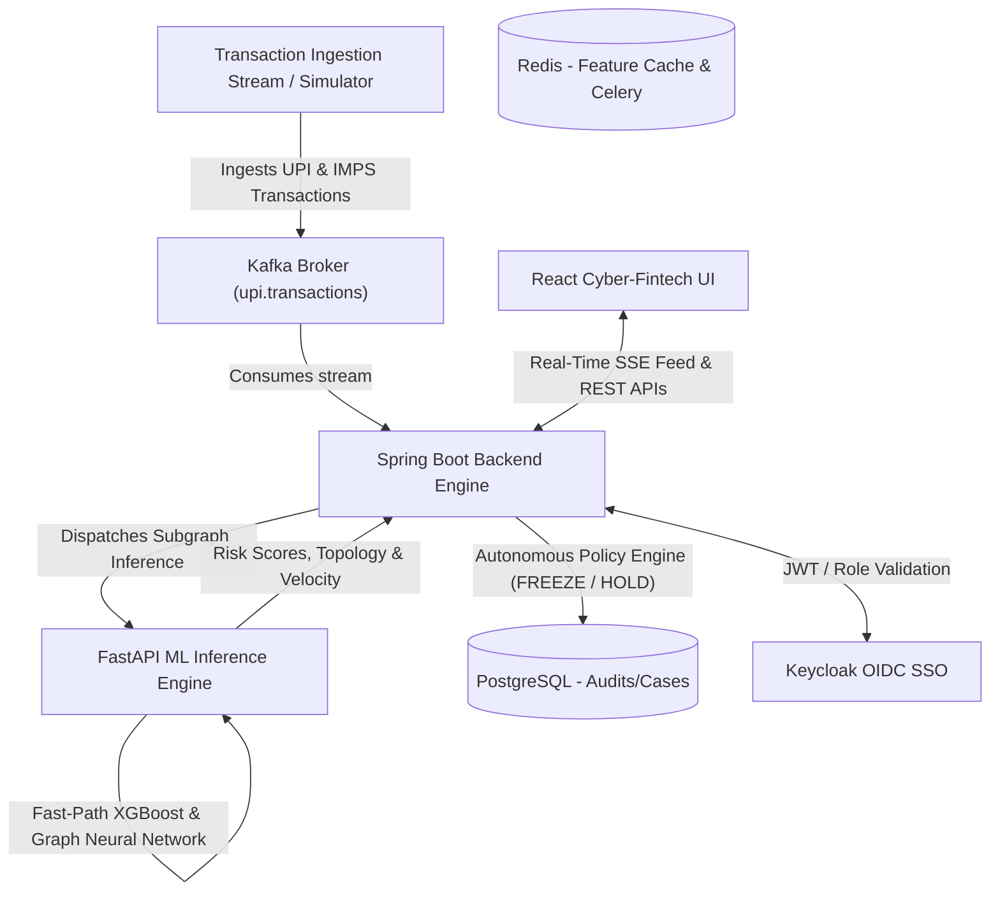

# MuleNet: Real-Time AI & Graph-Native Money Mule Detection

[](./LICENSE)
[](#-license--affiliation)
[](https://fastapi.tiangolo.com)
[](https://spring.io/projects/spring-boot)
[](https://react.dev)
[](https://www.docker.com)

> **MuleNet** is an enterprise-grade, graph-native real-time fraud decisioning platform engineered to detect and dismantle organized money mule networks (smurfing, multi-hop layering, pass-through mules, and coordinated syndicates) in milliseconds before illicit cash-outs occur.

---

## 📸 Platform Interface Preview

### 1. Unified Intelligence Dashboard
Real-time operational command center providing live risk posture, alert severity distribution, active layering investigations, and immediate freeze telemetry.



---

### 2. Mule Flow Explorer & Telemetry Bar
Interactive canvas visualizing transaction paths with glowing money badges in Indian Rupees (`₹`), compact Lakh notation (`1.18 L`), hop velocity metrics, and dispersal threshold filtering (`> ₹50k`).



---

### 3. Account Cash Flow Dynamics & Direct Hop Ledger
Deep-dive account dossier displaying inflow vs. outflow cards, pass-through laundering velocity gauge (`% funds drained immediately`), and individual transaction ledgers.



---

### 4. Real-Time Ingestion Stream Monitor
High-throughput transaction event monitor powered by Server-Sent Events (SSE) with millisecond-latency AI scoring, dynamic policy evaluation, and manual override controls.



---

### 5. External Threat Watchlist (I4C / NCRP)
Direct integration with the Indian Cybercrime Coordination Centre (I4C), NCRP suspect registries, and blacklisted device fingerprints for real-time risk score uplift.



---

## 🏗️ Architecture Overview

MuleNet combines a distributed, event-driven streaming pipeline with a dual-path Machine Learning inference engine:



### 🧠 Dual-Path AI Engine
1. **XGBoost Fast-Path (< 3 ms)**: Evaluates tabular transaction behavior, velocity surges, out-degree fan-out, and entropy.
2. **Graph Neural Network (GNN) Deep-Path (< 180 ms)**: Analyzes subgraph structural topology, cyclic routing, and multi-hop layering paths ($k \ge 3$).
3. **Unsupervised Anomaly Path**: Isolation Forest baseline detecting statistical drift in transaction volumes and account tenure.
4. **Autonomous Policy Engine**: Enforces automated actions (`FREEZE_IMMEDIATE`, `SOFT_HOLD`, `STEP_UP_MONITOR`) based on composite risk scores, I4C/NCRP intelligence uplift, and threshold configs.

---

## ⚙️ Tech Stack

| Domain | Technologies |
|---|---|
| **Backend Service** | Java 17, Spring Boot 3, Spring Security, Spring Kafka, Spring Data JPA, Hibernate |
| **Machine Learning** | Python 3.10+, FastAPI, PyTorch, PyTorch Geometric, XGBoost, Scikit-Learn, Celery |
| **Frontend UI** | React 19, Vite, ReactFlow, Lucide Icons, Material-UI, Recharts, Vanilla CSS Design System |
| **Event Streaming** | Confluent Kafka, Zookeeper |
| **Data & Cache** | PostgreSQL 15 (Relational Ledger), Redis 7 (Cache / Broker) |
| **Identity / Auth** | Keycloak 22 (OIDC / OAuth2 SSO) |
| **Containers** | Docker, Docker Compose |

---

## 💻 How to Run on Local Server

You can run MuleNet locally either **as standalone native services** (fastest for development) or **via Docker Compose** (full stack containerization).

### Option A: Running Standalone on Local Server (Without Docker)

#### Prerequisites
- **Python 3.10+**
- **Java 17+ (JDK)** & Maven
- **Node.js 18+** & npm
- *(Optional)* PostgreSQL running locally on port `5432`

#### 1. Start the Machine Learning Service (FastAPI)
Open a terminal:
```bash
cd ml_service

# Install Python requirements
pip install -r requirements.txt

# Launch FastAPI on port 8000
python -m uvicorn main:app --host 127.0.0.1 --port 8000 --reload
```
*ML service will be live at: [http://127.0.0.1:8000](http://127.0.0.1:8000) (Swagger docs at `/docs`)*

#### 2. Start the Backend Service (Spring Boot)
Open a second terminal:
```bash
cd backend

# Run with Maven wrapper
./mvnw spring-boot:run
```
*(On Windows cmd/powershell, run `mvnw.cmd spring-boot:run`)*  
*Backend will be live at: [http://localhost:8080](http://localhost:8080)*

#### 3. Start the Frontend Dashboard (React + Vite)
Open a third terminal:
```bash
cd frontend

# Install UI dependencies
npm install

# Launch Vite development server
npm run dev
```
*Frontend will be live at: **[http://localhost:5173](http://localhost:5173)** (or `http://127.0.0.1:5173`)*

#### 4. Instant Demo Seeding
To populate realistic multi-hop fraud cases and watchlists instantly:
- In the browser, open **Graph Explorer** and click **"Generate demo case"**, or
- Run via terminal:
```bash
curl -X POST http://localhost:8080/api/demo/seed
```

---

### Option B: Running with Docker Compose (All Services)

#### Prerequisites
- [Docker Desktop](https://www.docker.com/) installed and running (allocate at least 8 GB RAM).

#### 1. Configure Environment
```bash
cp .env.example .env
```

#### 2. Start All Services
```bash
docker compose up -d
```
*Or on Windows, simply double-click **`run_all.bat`**.*

#### 3. Access the System
- **Frontend UI**: [http://localhost:3000](http://localhost:3000)
  - **Login**: `investigator1` / **Password**: `password`
- **Backend API**: [http://localhost:8080/api/health](http://localhost:8080/api/health)
- **ML Engine Docs**: [http://localhost:8000/docs](http://localhost:8000/docs)
- **Keycloak Admin**: [http://localhost:8081](http://localhost:8081)

To stop the containers:
```bash
docker compose down
```

---

## 📊 Evaluation & Benchmarks

MuleNet models were evaluated on real PaySim financial transaction data and structured synthetic laundering graphs:

| Benchmark Metric | Model / Evaluator | Result |
|---|---|---|
| **ROC-AUC (FastPath XGBoost)** | PaySim Held-Out Split | **0.7567** |
| **PR-AUC (FastPath XGBoost)** | PaySim Held-Out Split | **0.0407** *(against 0.41% base rate)* |
| **Synthetic Topology ROC-AUC** | GNN + Centrality Features | **1.0000** |
| **Synthetic Topology PR-AUC** | GNN + Centrality Features | **1.0000** |
| **Scoring Latency / Transaction** | FastPath Pipeline | **0.0021 ms** |
| **Precision / Recall at Threshold** | Optimal F1 Operating Point | Precision: **0.9934** / Recall: **1.0000** |

### 💰 Economic Impact & Recovery
- **False-Positive Mitigation**: Automated hard freezes (`FREEZE_IMMEDIATE`) are strictly reserved for verified scores $\ge 70.0$. Borderline transactions route to `SOFT_HOLD` (preserving inbound liquidity while blocking outbound dissipation), saving institutions estimated thousands in operational overhead.
- **Demonstration Batch Recovery**: Across 3 multi-hop fraud networks totaling **₹6,43,000** in complaints, MuleNet auto-intercepted **₹3,20,000** before cash-out (**49.8% direct fund recovery rate**).

---

## 🧪 Testing

```bash
# Backend unit & integration tests
cd backend && ./mvnw clean test

# E2E Kafka streaming test
python scripts/kafka_e2e_test.py

# OAuth2 / Keycloak verification test
python scripts/oauth2_e2e_test.py

# ML training & validation suite
python ml_service/training/train_and_test.py
```

---

## 📄 License & Affiliation

MuleNet is released under the **MIT License**.

**Affiliated to the NoString team.**

See the [LICENSE](./LICENSE) file for complete terms and copyright details.
