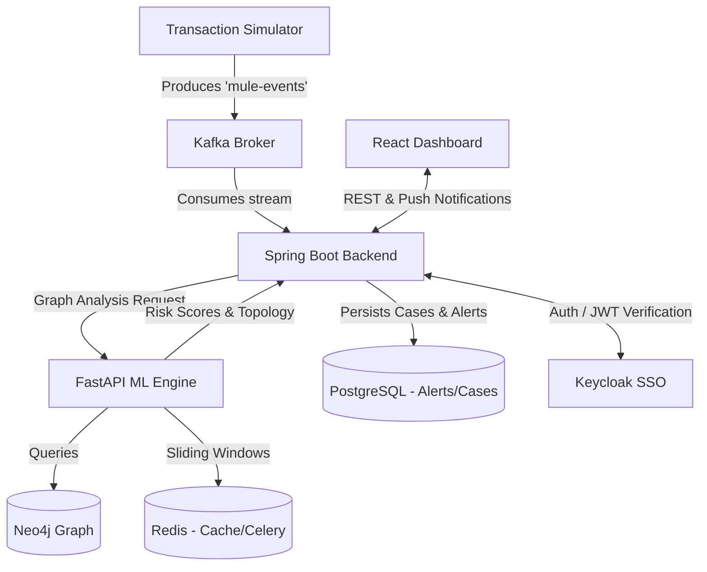

# MuleNet: AI Fraud Detector

MuleNet is a state-of-the-art, graph-native real-time fraud decisioning platform designed to detect and dismantle organized money mule networks (smurfing, structuring, and money laundering) in real-time. Traditional rule-based fraud systems often miss complex, decentralized flows of illicit funds. MuleNet ingests streaming transaction data, applies a hybrid machine learning approach—combining an XGBoost fast-path, a Graph Neural Network (GNN) deep-path, and unsupervised anomaly detection—and leverages a dynamic policy engine to auto-freeze critical threats and alert investigators before cash-out occurs.

---

## 🏗️ Architecture Overview

MuleNet features a full-stack, distributed architecture orchestrated through event-driven streams and REST APIs:



---

## ⚙️ Tech Stack

- **Backend**: Java 17, Spring Boot, Spring Security, Spring Kafka, Hibernate
- **Machine Learning**: Python 3.10+, FastAPI, XGBoost, Scikit-Learn, Celery
- **Frontend**: React, TypeScript, Vite, Tailwind CSS
- **Infrastructure**: Docker, Docker Compose
- **Event Streaming**: Confluent Kafka, Zookeeper
- **Data Stores**: PostgreSQL (Relational), Neo4j (Graph), Redis (Cache & Celery Broker)
- **Identity Provider**: Keycloak (OIDC SSO)

---

## 🚀 Setup Guide

MuleNet is fully containerized. Follow these steps to run the complete stack locally using Docker Compose.

### Prerequisites
- Docker & Docker Compose installed and running.
- Minimum 8GB RAM allocated to Docker.
- (Optional) JDK 17+ and Python 3.10+ if running services outside containers.

### 1. Environment Configuration
Copy the sample environment file to configure your local credentials:
```bash
cp .env.example .env
```
*(You can leave the default values in `.env` for local testing. This file removes hardcoded credentials from the repository.)*

### 2. Start the Stack
Spin up all services in detached mode (this will start Postgres, Redis, Neo4j, Kafka, Zookeeper, Keycloak, Backend, ML Service, Celery Worker, and Frontend):
```bash
docker-compose up -d
```
*Note: The first launch will take several minutes to pull images and build the custom containers.*

### 3. Verify Health & Access the App
Wait a few moments for Keycloak and Kafka to fully initialize. Once ready, access the system:
- **Frontend Dashboard**: Navigate to `http://localhost:3000`
- **Test Credentials**: The stack automatically bootstraps a Keycloak realm. Login using:
  - **Username**: `investigator1`
  - **Password**: `password`
- **Backend API**: `http://localhost:8080/api/health`
- **ML Service API**: `http://localhost:8000/docs`

### 4. Running Tests
- **Backend Unit Tests**: Ensure you have Java 17+, then run:
  ```bash
  cd backend
  ./mvnw clean verify
  ```
- **Kafka Streaming E2E Test**: 
  ```bash
  python scripts/kafka_e2e_test.py
  ```
- **OAuth2 Token E2E Test**:
  ```bash
  python scripts/oauth2_e2e_test.py
  ```
- **Celery Task Test**:
  ```bash
  python scripts/celery_test.py
  ```

---

## 🚧 Current Status & Known Limitations

MuleNet is in an active **Beta / Buildathon-Ready** state.
- **Auth**: Keycloak is fully integrated for SSO using a bootstrap realm file (`KeycloakRealm.json`). For production, these credentials must be rotated.
- **Machine Learning Models**: The `trained_models/` directory contains real serialized artifacts (XGBoost, GNN weights, and Scalers) trained on synthetic graph data with a ~30% anomaly/fraud rate. The data generation logic can be found in `ml_service/ml_models.py`.
- **Deployment**: Local containerization via `docker-compose` is the primary verified deployment target. Cloud deployment templates (e.g., `render.yaml`) are provided but require external cloud credentials to execute.
- For a detailed log of recent architectural assumptions and fixes, please review:
  - [FIXLOG.md](./FIXLOG.md)
  - [DECISIONS.md](./DECISIONS.md)

---

## 📄 License & Contributors

MuleNet is released under the MIT License. 
Created and maintained by the MuleNet Buildathon Team.
